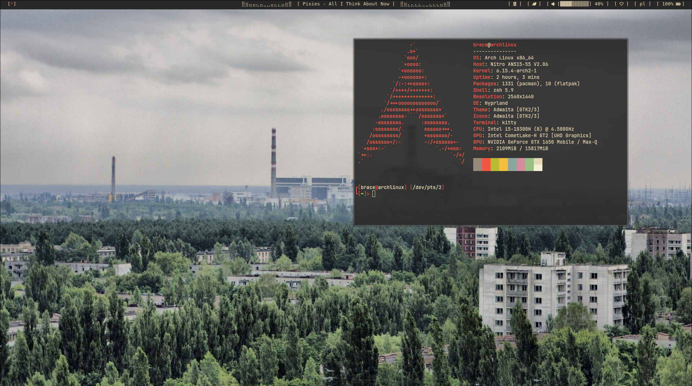

# arch-rice

My Hyprland Arch linux dot files

`Yeah I love postpunk and red`

---


---

## What I'm use?
1. WM - Hyprland
2. OS - Arch Linux
3. Theme - Gruvbox
4. Terminal - Kitty
5. Shell - zsh (darkblood theme)
6. Bar - Polybar
7. dmenu - Wofi
8. Text editor - neovim

## Setup
1. go to your `.config`
```bash
cd ~/.config
```
2. clone the repo
```bash
git clone https://github.com/Cryobs/arch-rice.git .
```
3. Install dependencies
```bash
sudo pacman install kitty zsh polybar wofi nvim neofetch cava playerctl networkmanager
```
(or use your package manager)

4. reboot
```bash
sudo reboot
```
5. And you have the sickest rice

## cava polybar config
I use naviterm for music but u can change that:
1. go to `~/.config/polybar/scripts`
```bash
cd ~/.config/polybar/scripts
```
2. edit `cava.sh`
```bash
nano cava.sh
```
(or another text editor)

3. And change in line 38 `playerctl --player=naviterm ...`, change `naviterm` to your music player for example `spotify`
4. Save `Ctrl+S` and exit `Ctrl+X`
